# IntelliDocAI 🧠📚

*Intelligent Document Processing & Retrieval-Augmented Generation (RAG) Pipeline*

[](https://python.org)
[](LICENSE)
[](https://github.com/mansigambhir-13/DocumindAI)

## 🎯 Overview

DocumindAI is a comprehensive **Retrieval-Augmented Generation (RAG)** system that transforms your medical resource  documents into an intelligent, searchable knowledge base. Upload PDFs and images, ask questions in natural language, and get AI-powered answers with source citations.

### ✨ Key Features

- **🔍 Advanced OCR**: Extract text from PDFs and images with high accuracy
- **🧩 Smart Chunking**: Intelligently segment documents for optimal retrieval
- **🏷️ Keyword Extraction**: Automatically identify important terms and concepts
- **🚀 Vector Embeddings**: Create semantic representations for similarity search
- **💬 AI-Powered Q&A**: Ask questions and get contextual answers
- **🌐 Web Interface**: Beautiful Streamlit demo application
- **🎯 Theme Analysis**: Discover patterns and insights across your documents
- **🛠️ Interactive CLI**: User-friendly command-line interface
- **📊 Progress Tracking**: Monitor pipeline status and completion

## 🚀 Quick Start

### 1. Clone & Setup

```bash
git clone https://github.com/mansigambhir-13/DocumindAI.git
cd DocumindAI
pip install -r requirements.txt
```

### 2. Initialize Environment

```bash
python main.py setup
```

This creates the directory structure and sample configuration files.

### 3. Configure API Keys (Optional but Recommended)

Copy `.env.sample` to `.env` and add your API keys:

```bash
cp .env.sample .env
```

Edit `.env` with your preferred AI service:

```env
# Choose at least one for enhanced features
GROQ_API_KEY=your_groq_api_key_here
GEMINI_API_KEY=your_gemini_api_key_here  
OPENAI_API_KEY=your_openai_api_key_here
ANTHROPIC_API_KEY=your_anthropic_api_key_here
```

### 4. Add Your Documents

```bash
# Place your PDF and image files in data/raw/
cp /path/to/your/documents/* data/raw/
```

### 5. Run the Pipeline

```bash
# Process all documents and build the knowledge base
python main.py --full

# Start asking questions!
python main.py --search
```

### 6. Launch Web Interface (Optional)

```bash
# Launch beautiful Streamlit demo
streamlit run demo.py

# Open browser to http://localhost:8501
```

## 📋 Requirements

### System Requirements
- **Python**: 3.8 or higher
- **OS**: Windows, macOS, or Linux
- **Memory**: 4GB+ RAM recommended
- **Storage**: 1GB+ free space

### Dependencies

**Core Libraries:**
```
streamlit>=1.28.0            # Web interface
PyMuPDF>=1.23.0          # PDF processing
pytesseract>=0.3.10      # OCR engine
Pillow>=9.0.0            # Image processing
opencv-python>=4.8.0     # Computer vision
numpy>=1.21.0            # Numerical computing
scikit-learn>=1.3.0      # Machine learning
sentence-transformers>=2.2.0  # Text embeddings
```

**Optional (Enhanced Features):**
```
google-generativeai>=0.3.0    # Google Gemini API
openai>=1.0.0                  # OpenAI GPT API
anthropic>=0.8.0               # Claude AI
qdrant-client>=1.6.0           # Vector database
python-dotenv>=1.0.0           # Environment management
```

## 🛠️ Usage

### Command Line Interface

#### Pipeline Operations
```bash
# Run complete pipeline
python main.py --full

# Run individual steps
python main.py --step ocr        # OCR processing
python main.py --step chunking   # Text chunking
python main.py --step keywords   # Keyword extraction
python main.py --step embeddings # Vector embeddings

# Force re-run completed steps
python main.py --full --force
```

#### Interactive Tools
```bash
# Launch semantic search interface
python main.py --search

# Launch theme analysis tool
python main.py --themes

# Interactive menu mode
python main.py --interactive

# 🌐 Launch web demo interface
streamlit run demo.py
```

#### Status & Monitoring
```bash
# System status dashboard
python main.py --status

# Detailed help guide
python main.py --help-detailed

# Show version information
python main.py --version
```

### Interactive Search Example

**Command Line Interface:**
```
🔍 Medical DocumindAI Search Interface
===============================

💬 Ask a question about your documents:
> What are the main findings of the research?

🤖 AI Response:
Based on the analyzed documents, the main findings include:

1. **Performance Improvement**: The new methodology showed a 23% improvement...
2. **Cost Reduction**: Implementation costs were reduced by 15%...
3. **User Satisfaction**: Survey results indicated 89% user satisfaction...

📚 Sources:
• research_report.pdf (Page 5-7)
• methodology_paper.pdf (Page 12)
• survey_results.pdf (Page 3)

> 
```


The Streamlit web interface provides:
- **🎛️ Interactive Dashboard**: Real-time system statistics
- **🔍 Live Search Demo**: Beautiful search interface with instant results
- **📊 Technical Specs**: Comprehensive system architecture overview
- **🎯 Performance Metrics**: Live monitoring and analytics
- **🌟 Professional Design**: Enterprise-ready presentation

## 🏗️ Architecture

### Pipeline Stages

```mermaid
graph LR
    A[📄 Raw Documents] --> B[🔍 OCR Processing]
    B --> C[🧩 Text Chunking] 
    C --> D[🏷️ Keyword Extraction]
    D --> E[🚀 Vector Embeddings]
    E --> F[💬 Search & QA]
    E --> G[🎯 Theme Analysis]
```



### Directory Structure

```
DocumindAI/
├── 📁 data/
│   ├── raw/              # Input PDFs and images
│   ├── processed/        # OCR results
│   ├── chunks/          # Text segments
│   ├── keywords/        # Extracted keywords
│   ├── embeddings/      # Vector representations
│   └── themes/          # Analysis results
├── 📁 src/
│   ├── main.py          # Pipeline controller
│   ├── demo.py          # Streamlit web interface
│   ├── ocr.py           # Document processing
│   ├── chunking.py      # Text segmentation
│   ├── keywords.py      # Keyword extraction
│   ├── embeddings.py    # Vector generation
│   ├── search.py        # Q&A interface
│   └── themes.py        # Theme analysis
├── 📁 logs/             # Processing logs
├── 📄 requirements.txt  # Dependencies
├── 📄 .env.sample      # Configuration template
└── 📄 README.md        # This file
```

## 🎨 Web Interface Features

The included Streamlit demo (`demo.py`) provides a professional, production-ready interface:

### 🏠 Overview Dashboard
- **📊 Live Statistics**: Real-time metrics from your pipeline
- **🏗️ System Architecture**: Visual pipeline representation  
- **✅ Status Monitoring**: Component health and completion status
- **🎯 Performance Metrics**: Processing speed and quality indicators

### 🔍 Interactive Search Demo
- **💬 Natural Language Queries**: Ask questions in plain English
- **⚡ Instant Results**: Sub-300ms response times
- **📚 Source Citations**: Detailed document references with relevance scores
- **🎯 Smart Suggestions**: Pre-built sample queries for testing
- **📈 Search Analytics**: Query history and performance tracking

### 📊 Technical Specifications
- **🛠️ System Components**: Detailed architecture breakdown
- **💻 Code Examples**: Implementation highlights and algorithms
- **📈 Performance Metrics**: Real-time system monitoring
- **🚀 Deployment Info**: Production readiness indicators

### 🎨 Design Highlights
- **🌟 Modern UI**: Glass-morphism design with gradient backgrounds
- **📱 Responsive**: Works beautifully on desktop and mobile
- **🎭 Demo Mode**: Smooth demonstration experience
- **⚡ Real-time**: Live data updates and interactive elements

### Launch the Web Demo
```bash
# Install Streamlit (if not already installed)
pip install streamlit>=1.28.0

# Launch the demo
streamlit run demo.py

# Opens automatically at http://localhost:8501
```

## ⚙️ Configuration

### Environment Variables

Medical DocumindAI supports extensive configuration through environment variables:

#### AI Service Selection
```env
# Primary recommendation for balanced performance
GROQ_API_KEY=your_key        # Fast inference, generous free tier
GEMINI_API_KEY=your_key      # Excellent embeddings, competitive pricing

# Alternative providers
OPENAI_API_KEY=your_key      # Industry standard, high quality
ANTHROPIC_API_KEY=your_key   # Claude AI, excellent reasoning
```

#### Processing Configuration
```env
# OCR Settings
OCR_DPI=300                  # Image resolution for OCR
OCR_LANGUAGE=eng             # Tesseract language pack
ENHANCE_IMAGE=true           # Pre-process images for better OCR

# Text Processing
CHUNK_SIZE=1000              # Characters per chunk
CHUNK_OVERLAP=200            # Overlap between chunks
MIN_PARAGRAPH_LENGTH=50      # Minimum paragraph size

# Search Settings
TOP_K_CHUNKS=10              # Initial retrieval count
FINAL_CHUNKS=3               # Context for answer generation
SIMILARITY_THRESHOLD=0.3     # Minimum similarity score
```

#### Advanced Options
```env
# Vector Database (Optional)
QDRANT_URL=https://your-cluster.qdrant.tech
QDRANT_API_KEY=your_key

# Performance Tuning
EMBEDDING_BATCH_SIZE=32      # Batch processing size
MAX_RETRIES=3                # API retry attempts
DEBUG=false                  # Debug logging
```

## 🎯 Use Cases

### 📚 Research & Academia
- **Literature Review**: Analyze dozens of research papers simultaneously
- **Citation Discovery**: Find relevant sources and connections
- **Methodology Comparison**: Compare approaches across studies

### 🏢 Business Intelligence
- **Document Analysis**: Process reports, presentations, and memos
- **Compliance Review**: Search through regulatory documents
- **Knowledge Management**: Build searchable company knowledge base

### ⚖️ Legal Research
- **Case Law Analysis**: Search through legal documents and precedents
- **Contract Review**: Extract key terms and obligations
- **Regulatory Compliance**: Navigate complex legal requirements

### 🏥 Healthcare
- **Medical Literature**: Search through research papers and guidelines
- **Patient Records**: Organize and search medical documentation
- **Drug Information**: Analyze pharmaceutical documentation

## 🔧 Troubleshooting

### Common Issues

#### No Documents Found
```bash
# Check your data directory
python main.py --status

# Verify file placement
ls data/raw/
```

**Solution**: Ensure PDF and image files are in `data/raw/` directory.

#### OCR Failures
```
❌ Tesseract not found
```

**Windows Solution**:
```bash
# Install Tesseract
choco install tesseract
# OR download from: https://github.com/UB-Mannheim/tesseract/wiki
```

**macOS Solution**:
```bash
brew install tesseract
```

**Linux Solution**:
```bash
sudo apt-get install tesseract-ocr
```

#### API Key Issues
```
❌ API key not configured
```

**Solution**: Add your API key to `.env` file:
```env
GROQ_API_KEY=your_actual_key_here
```

#### Web Interface Issues
```
❌ Streamlit not starting
```

**Solution**: Install/update Streamlit:
```bash
pip install --upgrade streamlit
streamlit run demo.py
```

**Port conflicts**: Use different port:
```bash
streamlit run demo.py --server.port 8502
```

#### Memory Issues
```
❌ Out of memory during processing
```

**Solutions**:
- Reduce `CHUNK_SIZE` in `.env`
- Process fewer documents at once
- Use smaller embedding models
- Increase system RAM

### Performance Optimization

#### Faster Processing
```env
# Use local embeddings (no API calls)
EMBEDDING_MODEL=sentence-transformers/all-MiniLM-L6-v2

# Reduce chunk overlap
CHUNK_OVERLAP=100

# Smaller batch sizes
EMBEDDING_BATCH_SIZE=16
```

#### Better Quality
```env
# Higher quality embeddings
EMBEDDING_MODEL=text-embedding-004

# More context for answers
FINAL_CHUNKS=5
TOP_K_CHUNKS=15

# Better OCR quality
OCR_DPI=400
ENHANCE_IMAGE=true
```

## 🤝 Contributing

We welcome contributions! Here's how to get started:

### Development Setup
```bash
# Fork and clone the repository
git clone https://github.com/yourusername/DocumindAI.git
cd DocumindAI

# Create virtual environment
python -m venv venv
source venv/bin/activate  # On Windows: venv\Scripts\activate

# Install development dependencies
pip install -r requirements.txt
pip install -r requirements-dev.txt

# Run tests
python -m pytest tests/
```

### Contributing Guidelines
1. **Fork** the repository
2. **Create** a feature branch (`git checkout -b feature/amazing-feature`)
3. **Commit** your changes (`git commit -m 'Add amazing feature'`)
4. **Push** to the branch (`git push origin feature/amazing-feature`)
5. **Open** a Pull Request

### Areas for Contribution
- 🔧 **New AI Providers**: Add support for additional AI services
- 🌐 **Web Interface**: Enhance the Streamlit demo with new features
- 📊 **Visualization**: Enhanced theme analysis charts
- 🔍 **Search Improvements**: Better ranking algorithms
- 📱 **Mobile Support**: Mobile-friendly interfaces
- 🌍 **Internationalization**: Multi-language support

## 📈 Roadmap

### Version 2.0 (Planned)
- [ ] 🌐 **Web Interface**: Browser-based UI
- [ ] 📊 **Advanced Analytics**: Document insights dashboard
- [ ] 🔄 **Real-time Sync**: Watch folder for new documents
- [ ] 🎨 **Custom Models**: Train domain-specific embeddings
- [ ] 📱 **API Server**: RESTful API for integrations

### Version 2.1 (Future)
- [ ] 🤖 **Multi-Agent System**: Specialized AI agents
- [ ] 🔗 **Integration Hub**: Connect to popular platforms
- [ ] 🎯 **Smart Recommendations**: Proactive insights
- [ ] 🔒 **Enterprise Security**: Advanced access controls

## 📄 License

This project is licensed under the MIT License - see the [LICENSE](LICENSE) file for details.

## 🙏 Acknowledgments

- **Sentence Transformers** for excellent embedding models
- **Tesseract OCR** for robust text extraction
- **PyMuPDF** for PDF processing capabilities
- **OpenAI, Google, Anthropic** for AI API services
- **Qdrant** for vector database technology


<div align="center">

**⭐ Star this project if you find it useful!**

Made with ❤️ by [Mansi Gambhir](https://github.com/mansigambhir-13)

</div>
